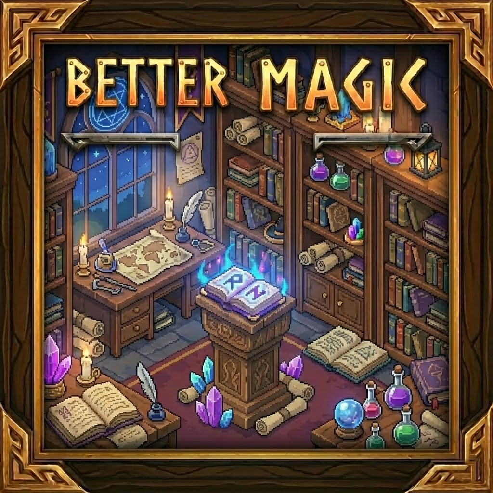

# 🔮 Better Magic

> **"Harness the hidden forces and reshape the elements."**
> *Expanding the magical potential of Hytale while preserving the vanilla aesthetic.*

  

---

## 📖 About The Mod

**Better Magic** enhances the magical crafting system by introducing new **arcane artifacts, grimoires, and magical tools** designed to naturally integrate into the world of Hytale.
The goal of the mod is to **expand magical progression** while keeping the balance and visual style consistent with the base game.

---

## ✨ Features

The current version introduces new craftable magical artifacts available through the **Arcanist's Workbench**.

| Item                             | Type     | Description                                                                              |
| -------------------------------- | -------- | ---------------------------------------------------------------------------------------- |
| 🔥 **Grimoire: Rekindle Embers** | Grimoire | An ancient two-handed grimoire infused with **void-touched ember magic**, allowing the caster to command the remnants of the fallen and raise skeletal warriors from ancient remains. |
| 🧈 **Midas Stick**               | Artifact | A rare enchanted rod infused with alchemical power connected to gold transmutation.      |

---

## 📦 Recipes

### Grimoire: Rekindle Embers

* Ruby ×1
* Heavy Leather ×5
* Essence of Fire ×20
* Cindercloth Scraps ×20

### Midas Stick

* Stick ×1
* Gold Ingot ×20
* Greater Essence of Life ×20

---

## 🚀 Upcoming Updates

### **V 1.1.0**

* New grimoires
* Additional magical crafting materials
* Expanded Arcanist progression tiers

---

## 🛠 Installation

1. Download the `BetterMagic` mod folder or archive.
2. Place it into your Hytale mods directory:
   `Hytale/mods/`
3. Launch the game and access new recipes via the **Arcanist's Workbench**.

---

## 🤝 Contributing

Suggestions for new magical items, grimoires, or balanced arcane mechanics are welcome.
Open an Issue or Pull Request to contribute.

---

*Created by Loocik*
